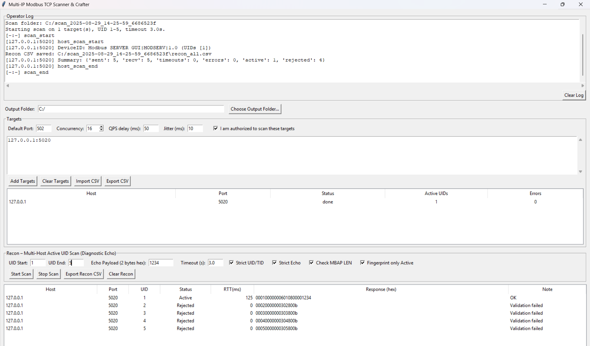

# Mobus-Recon

**Mobus-Recon** is a set of GUI tools for learning and experimenting with the Modbus TCP protocol. It includes:

- a raw-packet sender + reconnaissance client (single host)
- a graphical Modbus TCP server for safe testing
- a multi-IP scanner/crafter with logging and basic fingerprinting

> ⚠️ **Ethical use only.** Scan or test only systems you own or are explicitly authorized to assess. Unauthorized scanning may be illegal.
## Features

### `client_gui.py`
- Single-host sender and recon tool
- Diagnostic Echo (FC `0x08`) sweep with strict validation (UID/TID match, echo payload, MBAP LEN)
- Optional malicious packet toggles (invalid FC, out-of-range address, incorrect LEN, extra bytes, corrupted MBAP)
- Manual hex or subfield-based packet crafting with auto-fill for common function codes
- Device-ID fingerprinting (`0x2B/0x0E`) for active UIDs
- Recon CSV export and main-log export

### `server_gui.py`
- GUI Modbus TCP server (default bind `0.0.0.0:5020`)
- Edit coils, discrete inputs, holding registers, and input registers (double-click to change)
- Set Device Identification (Vendor, Product, Revision) for FC `0x11` and `0x2B/0x0E`
- Optional Unit ID enforcement (respond only to one UID)
- Console logging to observe behavior with malformed frames

### `multi_ip_scanner.py`
- Concurrent multi-host UID scanning (Diagnostic Echo `0x08`)
- Target inputs support CIDR, IPv4 ranges, and host or `host:port` lists
- Per-host stats (active UIDs, errors), optional device-ID fingerprinting
- Structured logs (`scan.jsonl`, `operator.txt`) and CSV exports
- Manual MBAP+PDU packet crafting and send to selected/all targets
## Requirements

- Python 3.7+
- Tkinter (usually included; on some Linux distros install `python3-tk`)
- pymodbus (server component)

Install the server dependency:
```pip install pymodbus```
All other imports are from the Python standard library.

## Quick Start

Start the server (default port `5020`):
```python3 server_gui.py```

In another terminal, run either the single-host client or the multi-IP scanner:
```python3 client_gui.py```

or

```python3 multi_ip_scanner.py```

Point the client/scanner at `127.0.0.1:5020` (or wherever your server is bound).

## Usage
### Running the test server

Start the server GUI:
```python3 server_gui.py```


In the window you can:

- Select bind address and port — defaults to `0.0.0.0:5020`. Adjust as needed.
- Start/Stop — click **Start Server** or **Stop Server**.
- Edit Device Identification — the server reports Vendor, Product, and Revision via FC `0x11` and `0x2B/0x0E`. Use the **Device Identification** fields and click **Apply Device ID**.
- Enforce Unit ID — optionally respond only to a single Unit ID (slave address) instead of accepting all.
- Inspect/Edit data — tabs let you view/edit:
  - Holding Registers (FC `0x03`)
  - Coils (FC `0x01/0x05/0x0F`)
  - Discrete Inputs (FC `0x02`)
  - Input Registers (FC `0x04`)
  Double-click a cell to modify its value; changes apply immediately.

The GUI shows the current configuration status. Additional server logs print to the console (useful for understanding how malformed packets are handled).

**Protocol behavior notes (helpful during testing):**
- Invalid function codes → exception `0x01` (Illegal Function) where applicable.
- Out-of-range addresses → exception `0x02` (Illegal Data Address).
- Bad MBAP or inconsistent Length → often no response (frame dropped).
- Extra trailing bytes → tolerated if the frame is still parsable; otherwise the socket may reset.

## Single-host client & recon tool

Launch the client:
 
 ```python3 client_gui.py```
 
 

 
 **At the top:**
- Enter **Target** host/IP and **Port**.
- Click **Connect** (opens a test socket) or **Disconnect**. The status dot turns green/red.

**Main Log**
- Records everything sent/received.
- **Clear Main Log** to erase; **Export Main Log** to save as `.txt`.

**Malicious Packet Crafting Options**
- Toggle to corrupt **Function Code**, **Address**, **Length**, **add Extra Bytes**, or **Corrupt MBAP**.
- Or pick a predefined payload from the dropdown to load an example into the hex field.

**Manual Hex / Subfield Inputs**
- Craft packets by pasting full **MBAP+PDU** hex, or
- Enable **Use Subfield Inputs** to fill **Transaction ID**, **Protocol ID**, **Length**, **Unit ID**, **Function Code**, and **Data**.
- The function-code dropdown auto-fills common requests.

**Send**
- Click **Send Packet**. The response is shown as raw hex plus a decoded view (MBAP fields, FC, registers/coil values, and any exception codes).

**Recon — Active UID Scan**
- Performs a Diagnostic Echo (FC `0x08`) sweep across Unit IDs.
- Set **UID Start/End** (1–247), **Echo Payload** (exactly two hex bytes), and **Timeout**.

**Optional checks:**
- **Strict UID/TID match**
- **Strict Echo validation**
- **Check MBAP LEN**
- **Fingerprint ONLY Active UIDs** (sends `0x2B/0x0E` Read Device Identification)

- Click **Start Scan**. Results append to the table and the **Recon Log**.
- **Export Recon CSV** to save results; **Clear Recon Results** resets the table.

## Multi-host scanner & crafter

**Launch the scanner:**

```python3 multi_ip_scanner.py```



## Output Folder

Set an output directory (or click **Choose Output Folder…**). If blank, the app uses a writable default (for example `Documents/ModbusScans` or a temp folder).

## Targets

Paste targets (one per line) using any mix of:
- CIDR: `192.168.1.0/29`
- Range: `192.168.1.10-192.168.1.20`
- Host or `host:port`: `10.0.0.5:5020`

Set **Default Port**, **Concurrency**, **QPS delay (ms)**, and **Jitter (ms)**.  
Confirm **I am authorized to scan these targets**.  
Use **Add Targets / Clear Targets / Import CSV / Export CSV**. A table shows status, active UID count, and errors per host.

## Recon — Multi-Host Active UID Scan

Configure **UID Start/End**, **Echo Payload** (two hex bytes), **Timeout**.  
Options: **Strict UID/TID**, **Strict Echo**, **Check MBAP LEN**, **Fingerprint only Active**.  
Click **Start Scan** (or **Stop Scan** to cancel).  
Results appear live in the table; a summary prints when done.

## Logging & Exports

Each scan creates a folder like `scan_YYYY-MM-DD_HH-MM-SS_<id>` containing:
- `recon_all.csv` — all results
- `scan.jsonl` — structured event log (JSONL)
- `operator.txt` — human-readable operator log

You can also **Export Recon CSV** at any time.

## Manual Packet Crafting (inside scanner)

Choose **Send to highlighted targets** or **Send to ALL targets**.  
Paste **MBAP+PDU** hex, optionally enable **Invalid FC / Out-of-Range Addr / Incorrect LEN / Extra Bytes / Corrupt MBAP**, then click **Send Packet**. Responses are logged and added to the results table.

## Folder Layout (suggested)

- `client_gui.py`
- `server_gui.py`
- `multi_ip_scanner.py`
- `docs/`
  - `images/`
    - `server_gui.png` (placeholder)
    - `client_gui.png` (placeholder)
    - `scanner_gui.png` (placeholder)
- `logs/` (your exported logs and CSVs can live here)
- `LICENSE` (MIT)
- `README.md`

You can keep `docs/images` empty or add your own screenshots later.

## Troubleshooting

**Tkinter not found**  
Install the GUI package for your OS (for example, `python3-tk` on Debian/Ubuntu).

**Port already in use**  
Change the server port in the GUI, or stop the process holding the port.

**No responses / timeouts**  
Check host/port, firewall rules, and that the server is actually running and reachable.

**Cannot bind to port 502**  
Low ports (<1024) may require elevated privileges; use `5020` or another high port.

## Safety and Scope

- These tools are designed for lab/test networks.
- Do not use them to bypass security controls or disrupt production systems.
- Always obtain written authorization before scanning third-party networks.

## License

This project is released under the **MIT License**. See `LICENSE` for details.

## Acknowledgments

Built with the Python standard library and `pymodbus` for the server component.  
Thanks to the open-source community for making protocol education accessible.

